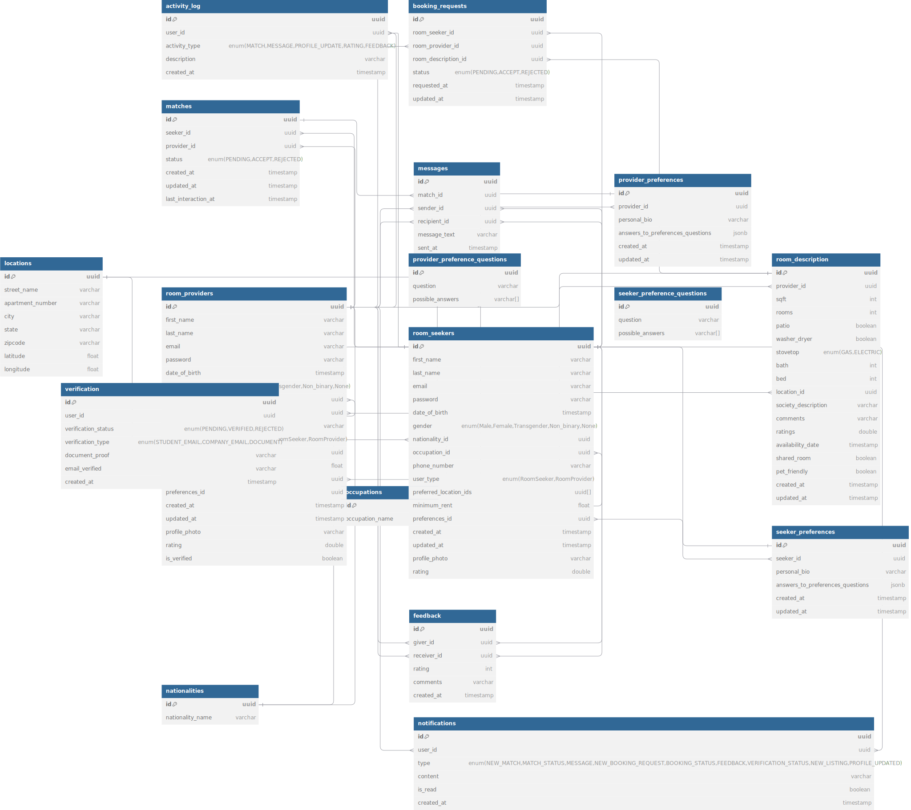

# RooMitra - Roommate Matching Platform

## Overview

RooMitra is a comprehensive roommate matching platform that connects room seekers with room providers using an intelligent compatibility matching system. The platform offers a seamless experience for users to find their ideal living situations based on preferences, lifestyle choices, and room requirements.

## Features

### User Types

1. **Room Seeker**: Users looking for rooms and roommates.
2. **Room Provider**: Users with rooms available for rent.

### Core Functionalities

#### 1. User Authentication & Profile Management

- Secure signup/login system.
- Separate flows for room seekers and providers.
- Profile customization and preference settings.

#### 2. Room Management

- **Room listing and description**:
  - Detailed room descriptions.
  - Amenity specifications.
  - Photo gallery (up to 5 photos).
  - Location details.
  - Room availability and pricing.

- Room search and filtering by location.

#### 3. Compatibility Matching System

- Percentage-based matching algorithm.
- Visual compatibility score display.
- Match categorization:
  - **High Match** (≥75%).
  - **Medium Match** (50-74%).
  - **Low Match** (<50%).

## Database Schema

[DBDiagram.io link](https://dbdiagram.io/d/RooMitra-6703766ffb079c7ebd8b55a7)



### Database - RooMitra-db

#### Collections

- **Matches**: Stores accepted or pending matches between room seekers and providers. The `lastInteractionAt` timestamp is useful for determining when the last activity occurred, helping drive features like reminders or tracking engagement.

- **Messages**: Stores conversation history between matched users (room seekers and providers).

- **Nationalities**: Lists nationalities for both room seekers and providers.

- **Notifications**: Manages various notifications for users based on activities like new matches, messages, and booking requests.

- **Occupations**: Stores occupation data for users.

- **ProviderPreferenceQuestions** and **SeekerPreferenceQuestions**: Manage predefined questions for both providers and seekers, and the possible answers they can choose from.

- **ProviderPreferences** and **SeekerPreferences**: Store each user’s answers to preference questions, helping in matching users with similar preferences.

- **RoomDescription**: Provides detailed room information, including location, amenities, and availability.

- **RoomProviders** and **RoomSeekers**: Store user profiles, including basic info, preferences, and room-related details.

- **Verification**: Manages verification processes, including email and document verification, ensuring that only verified users can engage in renting activities.

## Technical Architecture

### Frontend Routes

- **Public Routes**:
  - `/` - Landing Page.
  - `/login` - User Login.
  - `/userSignup` - User Registration.

- **Protected Routes**:
  - `/dashboard` - User Dashboard.
  - `/preferences-setup` - User Preferences.
  - `/room-details` - Room Management.
  - `/profile/:id` - User Profiles.
  - `/update-room-details` - Room Updates.

#API Documentation

## Authentication Endpoints

### User Registration
**POST /api/auth/signup**
Content-Type: application/json

```json
{
  "email": string,
  "password": string,
  "userType": "RoomSeeker" | "RoomProvider",
  "firstName": string,
  "lastName": string
}
```

**Response:**
```json
{
  "token": string,
  "user": UserObject
}
```

### User Login
**POST /api/auth/login**
Content-Type: application/json

```json
{
  "email": string,
  "password": string
}
```

**Response:**
```json
{
  "token": string,
  "user": UserObject
}
```

## User Management Endpoints

### Get User Profile
**GET /api/users/:id**
Authorization: Bearer {token}

**Response:**
```json
{
  "id": string,
  "email": string,
  "userType": string,
  "firstName": string,
  "lastName": string,
  "profileComplete": boolean,
  "preferences": PreferencesObject
}
```

### Update User Profile
**PUT /api/users/:id**
Authorization: Bearer {token}
Content-Type: application/json

```json
{
  "firstName": string,
  "lastName": string,
  "phone": string,
  "occupation": string,
  "nationality": string
}
```

**Response:** Updated UserObject

### Get User Preferences
**GET /api/users/preferences/:id**
Authorization: Bearer {token}

**Response:**
```json
{
  "id": string,
  "userId": string,
  "lifestylePreferences": LifestyleObject,
  "schedulePreferences": ScheduleObject,
  "budgetPreferences": BudgetObject
}
```

### Set User Preferences
**POST /api/users/preferences**
Authorization: Bearer {token}
Content-Type: application/json

```json
{
  "lifestylePreferences": {
    "smoking": boolean,
    "drinking": boolean,
    "pets": boolean,
    "cleanliness": number,
    "noise": number
  },
  "schedulePreferences": {
    "workSchedule": string,
    "sleepSchedule": string,
    "socialActivity": number
  },
  "budgetPreferences": {
    "maxRent": number,
    "utilitySharingPreference": string
  }
}
```

**Response:** PreferencesObject

## Room Management Endpoints

### Create Room Listing
**POST /api/room-description**
Authorization: Bearer {token}
Content-Type: multipart/form-data

```json
{
  "rent": number,
  "sqft": number,
  "rooms": number,
  "bath": number,
  "location": LocationObject,
  "amenities": AmenitiesObject,
  "photos": File[],
  "description": string,
  "availability": string
}
```

**Response:** RoomDescriptionObject

### Get Room Details
**GET /api/room-description/:id**
Authorization: Bearer {token}

**Response:**
```json
{
  "id": string,
  "providerId": string,
  "rent": number,
  "sqft": number,
  "rooms": number,
  "bath": number,
  "location": LocationObject,
  "amenities": AmenitiesObject,
  "photos": string[],
  "description": string,
  "availability": string,
  "createdAt": string,
  "updatedAt": string
}
```

### Update Room Details
**PUT /api/room-description/:id**
Authorization: Bearer {token}
Content-Type: multipart/form-data

```json
{
  // Same fields as POST request
}
```

**Response:** Updated RoomDescriptionObject

## Compatibility Endpoints

### Get Compatibility Score
**GET /api/compatibility-score/:seekerId/:providerId**
Authorization: Bearer {token}

**Response:**
```json
{
  "score": number,
  "breakdown": {
    "lifestyle": number,
    "schedule": number,
    "budget": number,
    "additional": number
  }
}
```

### Calculate Compatibility
**POST /api/compatibility/calculate**
Authorization: Bearer {token}
Content-Type: application/json

```json
{
  "seekerId": string,
  "providerId": string,
  "preferences": {
    "seeker": PreferencesObject,
    "provider": PreferencesObject
  }
}
```

**Response:**
```json
{
  "score": number,
  "breakdown": CompatibilityBreakdownObject
}
```

## Connection Management Endpoints

### Send Connection Request
**POST /api/connections/request**
Authorization: Bearer {token}
Content-Type: application/json

```json
{
  "fromUserId": string,
  "toUserId": string,
  "message": string
}
```

**Response:** ConnectionObject

### Get Connection Status
**GET /api/connections/status/:userId1/:userId2**
Authorization: Bearer {token}

**Response:**
```json
{
  "status": "NONE" | "PENDING" | "CONNECTED" | "BLOCKED"
}
```


## Compatibility Algorithm

The matching algorithm considers multiple factors:

1. **Lifestyle Preferences** (40% weight):
   - Smoking habits.
   - Drinking habits.
   - Dietary preferences.
   - Pets.
   - Cleanliness.
   - Noise level.

2. **Schedule Compatibility** (30% weight):
   - Work schedule.
   - Social activities.
   - Sleep schedule.

3. **Budget Alignment** (20% weight):
   - Utility sharing preferences.
   - Rent affordability.

4. **Additional Factors** (10% weight):
   - Age.
   - Gender.
   - Nationality.
   - Occupation.

### Score Calculation

```plaintext
final_score = (
    (lifestyle_score * 0.4) +
    (schedule_score * 0.3) +
    (budget_score * 0.2) +
    (additional_score * 0.1)
) * 100
```

## Installation & Setup

1. Clone the repository:

```bash
git clone https://github.com/Kavil-Jain-514/roomitra.git
```

2. Install dependencies:

```bash
# Frontend
cd client/roomitra-frontend
npm install

# Backend
cd backend/roomitra
mvn install
```

3. Environment Setup:

```plaintext
# Frontend (.env)
REACT_APP_API_URL=http://localhost:8080/api

# Backend (application.properties)
spring.data.mongodb.uri=mongodb://localhost:27017/roomitra
```

4. Run the application:

```bash
# Frontend
npm start

# Backend
./mvnw spring-boot:run
```

## Future Enhancements

- **Mobile App Development**: Create a mobile version for iOS and Android.
- **AI-based Recommendations**: Leverage machine learning to provide better match suggestions over time.
- **Real-time Messaging**: Implement WebSocket-based messaging for instant communication.
- **Advanced Analytics**: Provide insights to users about their matches and preferences.
- **Payment Integration**: Enable users to handle rent payments directly through the platform.

## License

This project is licensed under the MIT License. See the LICENSE file for details.

## Contributors

- **Kavil Jain** - Project Lead and Developer.
- Additional contributors are welcome! Please follow the contributing guidelines.
